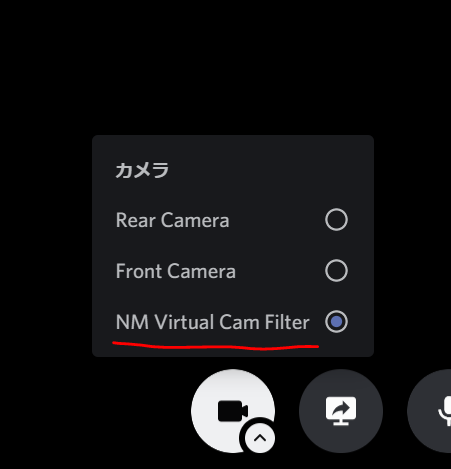

NMVCamFilter
==============



`stdafx.h`の`TARGET_WINDOW_NAME`で指定したウィンドウ名をもつウィンドウの画面をDiscordやZoomなどに映す仮想カメラです。DirectShowを利用しております。仮想カメラを自作する際の参考になればと思い、公開しました。

ここのコードを主に参考にしております。

[mysourcefilter](https://github.com/syu5-gh/mysourcefilter)

[svcam](https://github.com/aricatamoy/svcam)

DirectShowで仮想カメラを実装する際の注意点をQiitaにも記事としてあげました。こちらもぜひご覧ください。

[DirectShowで仮想カメラを自作しよう](https://qiita.com/HexagramNM/items/2311f025f3af758c83a0)

# ビルド方法

Visual Studio 2017で開発をしておりました。

1. コンパイルの際にはDirectShowのライブラリが必要です。[ここ](https://github.com/ganboing/sdk71examples)からダウンロードし、`multimedia/directshow/baseclasses`にあるコードをビルドしてください。

2. `baseclasses`をコンパイル出来たら、`NMVCamFilter`プロジェクトをC++の空のプロジェクトとしてつくり、その中にこのリポジトリ内の.cppファイル、.hファイル、`module.def`を入れてください。

3. `NMVCamFilter`プロジェクトのプロパティから以下のように設定してください。
- **「全般」→「構成の種類」**：ダイナミックライブラリ (.dll)
- **「全般」→「文字セット」**：Unicode文字セットを使用する
- **「C/C++」→「全般」→「追加のインクルードディレクトリ」**：`multimedia/directshow/baseclasses`フォルダの絶対パス
- **「C/C++」→「プリプロセッサ」→「プリプロセッサの定義」**：\
WIN32 \
_DEBUG（Debug構成の場合。Releaseの場合はNDEBUGに変更する。） \
_WINDOWS \
_USRDLL \
MYSOURCEFILTER_EXPORTS
- **「C/C++」→「言語」→「準拠モード」**：いいえ
- **「リンカー」→「全般」→「追加のライブラリディレクトリ」**：`baseclasses`のコンパイルにより生成された`Release`または`Debug`フォルダの絶対パス。x64プラットフォームの場合は`x64/Debug`や`x64/Release`になるので注意。
- **「リンカー」→「入力」→「モジュール定義ファイル」**：`module.def`

4. もし、プロジェクト名を`NMVCamFilter`から変更した場合は、`module.def`の`LIBRARY	"NMVCamFilter"`の部分のNMVCamFilter部分をプロジェクト名に変更してください。

生成されたdllファイルはwindowsのSystem32もしくはSysWOW64に入っている、`regsvr32.exe`で登録することで使えるようになります。


# 参考にしたコードの著作権表示（MITライセンス）

```
The MIT License (MIT)

Copyright (c) 2013 mahorigahama

Permission is hereby granted, free of charge, to any person obtaining a copy of
this software and associated documentation files (the "Software"), to deal in
the Software without restriction, including without limitation the rights to
use, copy, modify, merge, publish, distribute, sublicense, and/or sell copies of
the Software, and to permit persons to whom the Software is furnished to do so,
subject to the following conditions:

The above copyright notice and this permission notice shall be included in all
copies or substantial portions of the Software.

THE SOFTWARE IS PROVIDED "AS IS", WITHOUT WARRANTY OF ANY KIND, EXPRESS OR
IMPLIED, INCLUDING BUT NOT LIMITED TO THE WARRANTIES OF MERCHANTABILITY, FITNESS
FOR A PARTICULAR PURPOSE AND NONINFRINGEMENT. IN NO EVENT SHALL THE AUTHORS OR
COPYRIGHT HOLDERS BE LIABLE FOR ANY CLAIM, DAMAGES OR OTHER LIABILITY, WHETHER
IN AN ACTION OF CONTRACT, TORT OR OTHERWISE, ARISING FROM, OUT OF OR IN
CONNECTION WITH THE SOFTWARE OR THE USE OR OTHER DEALINGS IN THE SOFTWARE.
```
